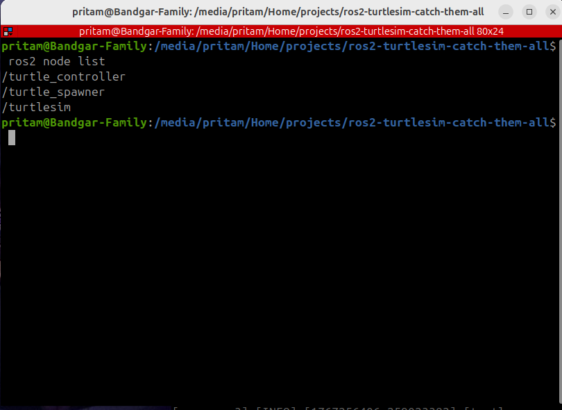
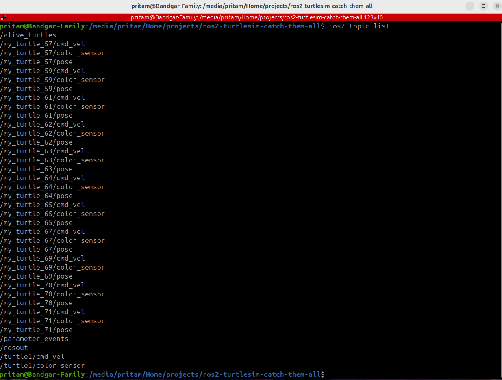
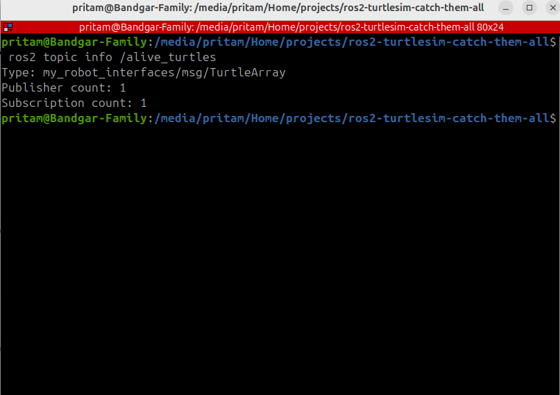
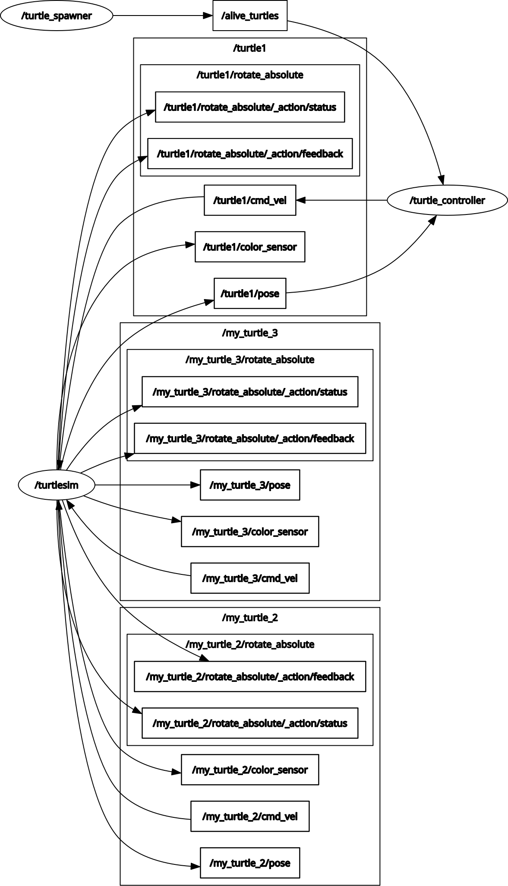
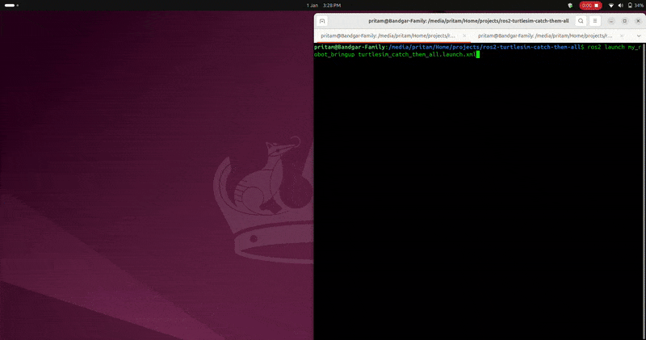

# 🐢 ROS2 Turtlesim – Catch Them All


---

## 📌 Overview
This project demonstrates a **multi-node ROS2 application** built using the **Turtlesim** simulator.
A primary turtle (`turtle1`) autonomously chases dynamically spawned turtles using **ROS2 nodes, topics, services, timers, and custom interfaces.**
The project focuses on **ROS2 fundamentals and runtime introspection,** not advanced robotics algorithms.

> ⚠️ **Transparency Note**:
  This project was completed by following a structured ROS2 course and reproducing the implementation step-by-step.
  The objective was to **understand ROS2 architecture, execution flow, and debugging tools**  through hands-on practice.

---

## 🧠 System Architecture

### Nodes
- **`/turtlesim`** (ROS2 provided)
     ROS2-provided simulation node. Publishes turtle pose and exposes `/spawn` and `/kill` services.

- **`/turtle_spawner`**
     Spawns turtles periodically and publishes the list of active turtles.

- **`/turtle_controller`**
     Subscribes to turtle pose and active turtle list, and publishes velocity commands to move `turtle1.`

---

## 🔄 Communication

### Topics
- `/turtle1/pose`
- `/turtle1/cmd_vel`
- `/alive_turtles`

### Services
- `/spawn`
- `/kill`

### Custom Interfaces

**`Turtle.msg`**

```text
string name
float32 x
float32 y
float32 theta
```

**`TurtleArray.msg`**

```text
Turtle[] turtles
```

**`CatchTurtle.srv`**

```text
string name
---
bool success
```

---

## 📂 Repository Structure
```text
ros2-turtlesim-catch-them-all/
├── README.md
├── screenshots/
│   ├── launch_and_simulation.png
│   ├── node_list.png
│   ├── topic_list.png
│   ├── alive_turtles_info.png
│   └── rqt_graph.png
├── videos/
│   └── turtlesim_demo.gif
├── src/
│   ├── my_robot_bringup/
│   │   ├── launch/
│   │   │   └── turtlesim_catch_them_all.launch.xml
│   │   ├── config/
│   │   │   └── catch_them_all_config.yaml
│   │   └── package.xml
│   ├── my_robot_interfaces/
│   │   ├── msg/
│   │   │   ├── Turtle.msg
│   │   │   ├── TurtleArray.msg
│   │   ├── srv/
│   │   │   └── CatchTurtle.srv
│   │   └── package.xml
│   └── turtlesim_catch_them_all/
│       ├── turtlesim_catch_them_all/
│       │   ├── turtle_controller.py
│       │   └── turtle_spawner.py
│       └── package.xml

```

---

## 🛠 Prerequisites
- Ubuntu 24.04 LTS
- ROS2 Jazzy
- Python 3.12

---

## ⚙️ Build Instructions

### Update dependencies
```bash
  rosdep update
  rosdep install --from-paths src --ignore-src -y
```

### Build workspace
```bash
  colcon build --symlink-install
```

### Source environment
```bash
  source install/setup.bash
```

---

## ▶️ Run the Project

```bash
ros2 launch my_robot_bringup turtlesim_catch_them_all.launch.xml
```

---

## 🔍 Runtime Introspection

### Node List

```bash
ros2 node list
```



### Topic List

```bash
ros2 topic list
```



### Topic Info

```bash
ros2 topic info /alive_turtles
```



### Node & Topic Graph

```bash
rqt_graph
```



---

## 🎥 Demo
A short demo video showing:
- Launch execution
- Turtle spawning
- Autonomous chasing behavior
- ROS2 introspection

📽 **Demo Video**:


---

## 🧪 Expected Behavior
- New turtles spawn periodically
- Main turtle (`turtle1`) chases active turtles
- System continues autonomously

---

## 🧠 ROS2 Concepts Demonstrated
- ROS2 Nodes & packages
- Publishers & subscribers
- Services
- Timers
- Custom interfaces
- Launch files
- Runtime introspection (`ros2 node`, `ros2 topic`, `rqt_graph`)

---

## 🚀 Possible Improvements
- Smarter target selection
- Multi-hunter turtles
- Event-based architecture
- Dockerized deployment

---

## 📜 Credits
Built by following the **ROS2 for Beginners** course by **Edouard Renard (Udemy)** as a learning exercise.

---

## 👤 Author

GitHub: https://github.com/Preetbandgar

