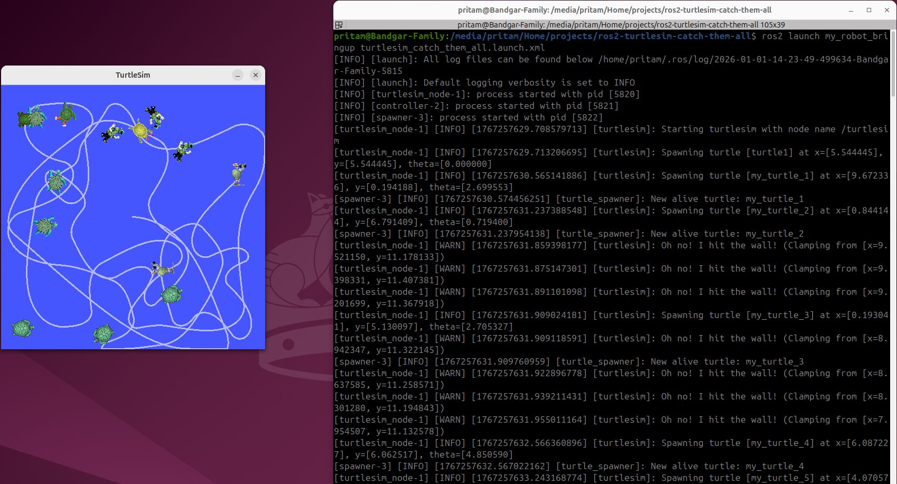

# 🐢 ROS2 Turtlesim – Catch Them All

## Overview
This project demonstrates a **multi-node ROS2 system** built using the Turtlesim simulator, where a master turtle autonomously tracks and catches dynamically spawned turtles.

The primary objective is to practice **ROS2 fundamentals**:
- ROS2 workspace and package structure
- Node execution and lifecycle
- Publishers, subscribers, services
- Timers and callbacks
- Custom message interfaces
- Runtime introspection using ROS2 CLI tools

This project focuses on **ROS2 software architecture and execution flow**, not advanced navigation, perception, or control algorithms.

---

## Transparency & Attribution
⚠️ **Transparency note**

This project was implemented by following and reproducing a guided, instructor-led implementation from the Udemy course **“ROS2 for Beginners” by Edouard Bernard**.

The purpose of this work was hands-on learning through replication, inspection, and minor modification in order to understand ROS2 concepts correctly and ethically.

---

## System Architecture

### Nodes

- **turtlesim_node** (ROS2 provided)
  - Runs the Turtlesim simulator
  - Provides `/spawn` and `/kill` services
  - Publishes turtle pose information

- **turtle_spawner**
  - Spawns new turtles periodically using the `/spawn` service
  - Maintains a list of currently alive turtles
  - Publishes turtle information on `/alive_turtles` using a custom message

- **turtle_controller**
  - Subscribes to `/turtle1/pose`
  - Subscribes to `/alive_turtles`
  - Runs a timer-based loop
  - Publishes velocity commands to `/turtle1/cmd_vel`

---

## Control Behavior (High-Level)
A small amount of control logic is included **only to demonstrate closed-loop behavior**.  
The controller computes linear and angular velocity commands based on the relative position of the target turtle so the system exhibits observable autonomous motion.

This logic is intentionally simple and **not intended to represent production-grade control**.

---

## Repository Structure
```
ros2-turtlesim-catch-them-all/
├── README.md
├── screenshots/                     # Screenshots used in this README
├── videos/                          # Short demo recordings
└── src/
    ├── my_robot_bringup/             # Launch and configuration package
    │   ├── launch/
    │   │   └── turtlesim_catch_them_all.launch.xml
    │   ├── config/
    │   │   └── catch_them_all_config.yaml
    │   ├── CMakeLists.txt
    │   └── package.xml
    │
    ├── my_robot_interfaces/          # Custom interfaces package
    │   ├── msg/
    │   │   ├── Turtle.msg
    │   │   ├── TurtleArray.msg
    │   │   └── HardwareStatus.msg
    │   ├── srv/
    │   │   └── CatchTurtle.srv
    │   ├── CMakeLists.txt
    │   └── package.xml
    │
    └── turtlesim_catch_them_all/     # Application logic package
        ├── package.xml
        ├── setup.py
        ├── setup.cfg
        ├── resource/
        └── turtlesim_catch_them_all/
            ├── __init__.py
            ├── turtle_controller.py
            └── turtle_spawner.py
```


---

## Build & Run

### Environment
- **OS:** Ubuntu 24.04.3 LTS  
- **ROS2:** Jazzy Jalisco  
- **Language:** Python 3.12

### Build
```bash
colcon build
source install/setup.bash
```

### Run
```bash
ros2 launch turtlesim_catch_them_all turtlesim.launch.py
```

---

## Execution Evidence

### Launch Execution & Simulation
```bash
ros2 launch turtlesim_catch_them_all turtlesim.launch.py
```


---

### ROS2 Node List
```bash
ros2 node list
```


---

### ROS2 Topic List
```bash
ros2 topic list
```


---

### Custom Message Output
```bash
ros2 topic echo /alive_turtles
```


---

### Node & Topic Graph
```bash
rqt_graph
```


---

## Demo Video
🎥 **Demo Video**  
[Watch the demo video](./videos/turtlesim_demo.gif)

---

## ROS2 Concepts Demonstrated
- ROS2 workspace and package structure
- Python-based ROS2 nodes
- Publishers, subscribers, and services
- Timers and callbacks
- Custom message interfaces
- Multi-node coordination
- Runtime introspection with ROS2 CLI tools
- Graph visualization using `rqt_graph`

---

## Notes
- Simulation is used to avoid hardware dependency
- Build artifacts and IDE cache files are excluded from version control
- This project serves as a **foundational ROS2 learning project**

---

## Credits
- **Course & Instructor:** Edouard Bernard — *ROS2 for Beginners* (Udemy)

LinkedIn: https://www.linkedin.com/in/edouard-renard-66449aa5/

Course link: https://www.udemy.com/course/ros2-for-beginners/

---

## Author
GitHub: https://github.com/Preetbandgar
